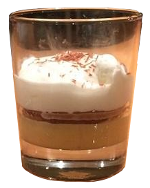

<h1 align="center">Doce Três Sabores</h1>

<h3 align="center">A arquitetura mais doce!</h3>

## Descrição
***Doce Três Sabores*** é um projeto da unidade curricular **DAE** -
*Desenvolvimento de Aplicações Empresariais* - lecionada no curso de
**Engenharia Informática** do **IPLeiria** - *Instituto Politécnico de Leiria* -
no 1º semestre do 3º ano. O projeto consiste em desenvolver uma aplicação
empresarial seguindo ***3 Tier Arquitecture***. Esta arquitetura é estruturada
da seguinte forma:

| Camada                  | Sabor                           | Descrição                                            |
| :---------------------: | :-----------------------------: | :--------------------------------------------------: |
| ***Presentation tier*** | Chantilly c/ raspa de chocolate | Responsável pela UI da aplicação.                    |
| ***Application Tier***  | Pudim de Café                   | Responsável pela lógica da aplicação.                |
| ***Data Tier***         | Bolacha MARIA                   | Responsável pela armazenação dos dados da aplicação. |

## Em que consiste
O objetivo deste projeto consiste no desenvolvimento duma plataforma digital que
permita aos projetistas calcular e selecionar os materiais adequados para
determinada estrutura metálica.
